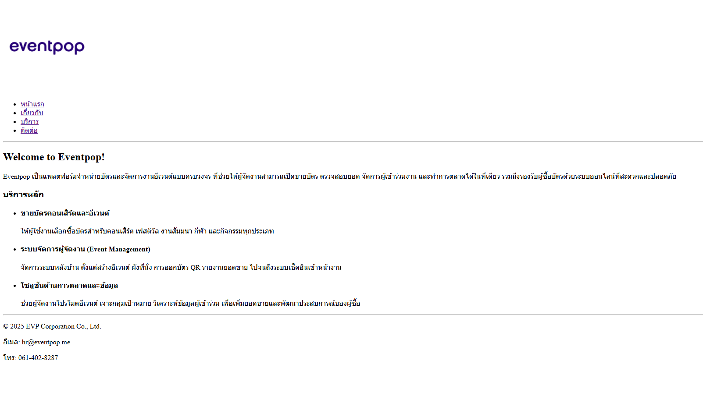
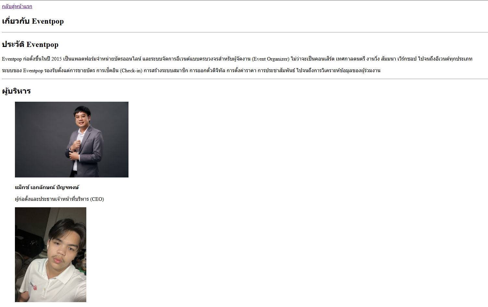
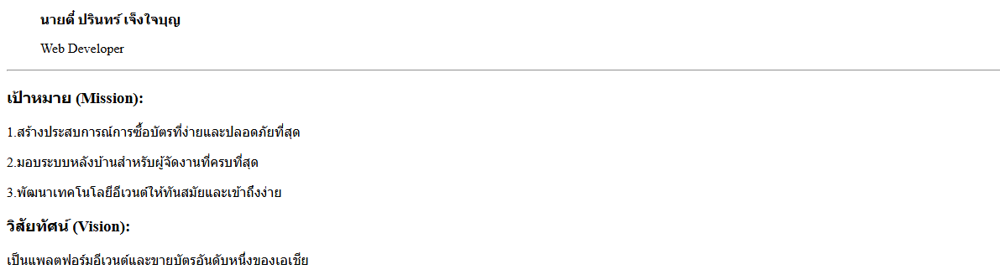
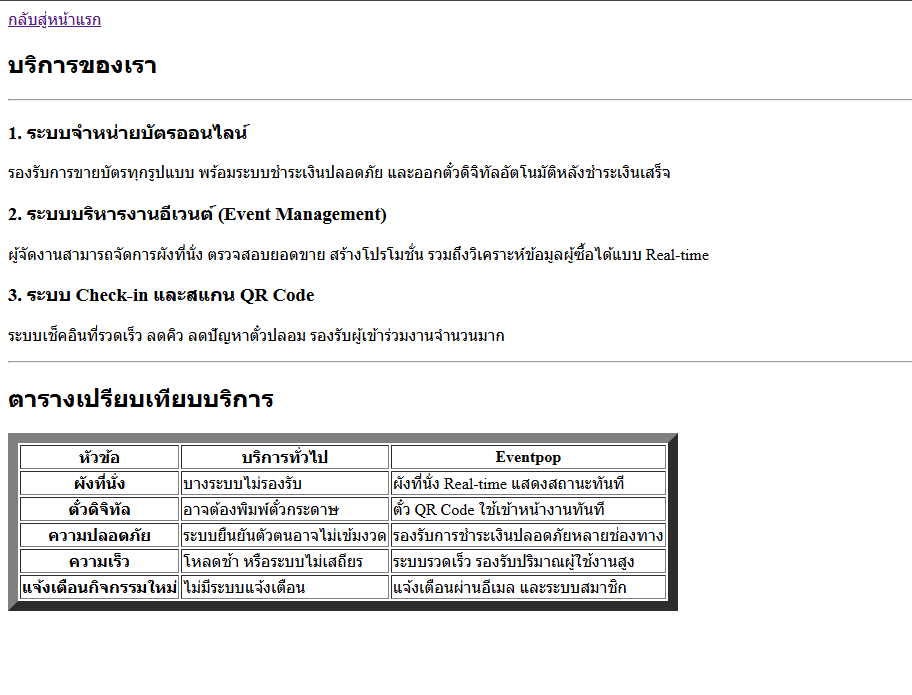
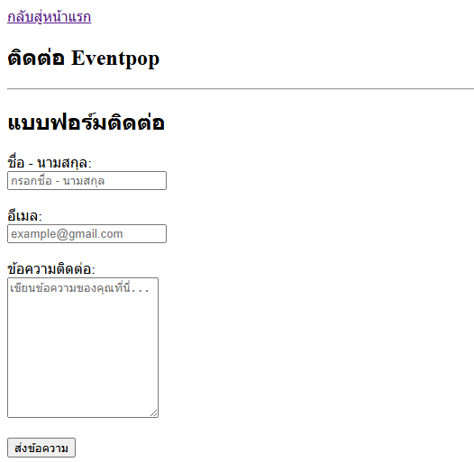
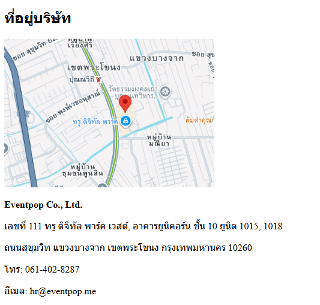

# Eventpop Website

เว็บไซต์ตัวอย่างสำหรับบริษัท Eventpop ผู้ให้บริการแพลตฟอร์มขายบัตรและระบบจัดการอีเวนต์  
ใช้เพื่อส่งงานอาจารย์เท่านั้น

# ฟีเจอร์หลักของเว็บ

- หน้าแรก พร้อมข้อมูลสรุปบริษัท
- หน้า About แสดงประวัติและผู้บริหาร Eventpop
- หน้า Services แสดงบริการ + ตารางเปรียบเทียบ
- หน้า Contact พร้อมฟอร์มติดต่อ
- เมนูเชื่อมโยงทุกหน้า

# โครงสร้างไฟล์

my-business-web  
├── index.html  
├── about.html  
├── services.html  
├── contact.html  
├── images/  
│ ├── logo.png  
│ ├── ceo-eventpop.jpg  
│ ├── map.png  
│ ├── parinwhiteshirt.jpg  
│ └── ...  
└── README.md

# ลิงก์ไปแต่ละหน้า (Page Links)

- [หน้าแรก](index.html)
  
- [เกี่ยวกับ](about.html)
  
  
- [บริการ](services.html)
  
- [ติดต่อ](contact.html)
  
  
